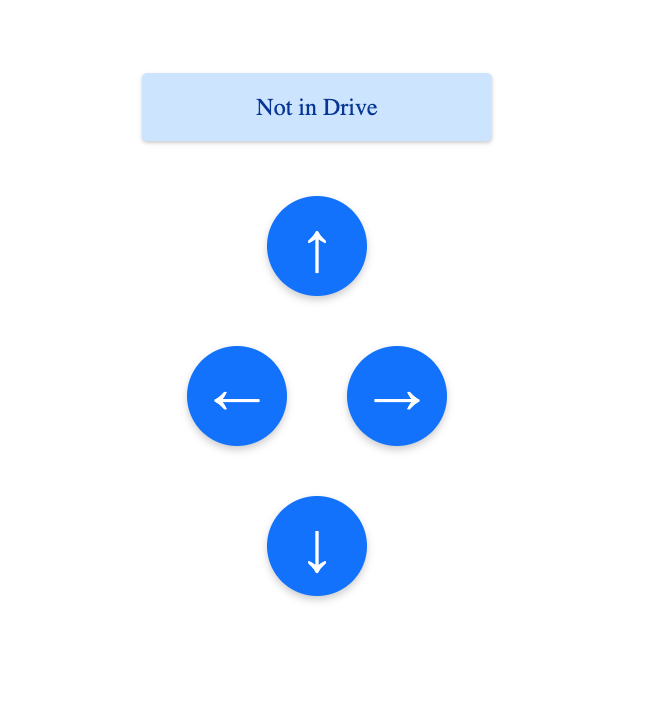

# ESP-32 HTTP Server
This ESP-32 server has a custom UI that sends GET requests to command the vehicle with forward, left, right, and backwards motion.

# 1. Data
To use the SPIFFS system on the ESP-32, you must put all relevant files under the **data** folder in this project directory. This includes the following
1. A `wifi_creds.txt` file, which should follow the format specified in `wifi_creds_template.txt`
2. A `server.html` file (you can modify this)

## 2. Before running the server
To start the server a WiFi connection and its corresponding credentials are required. Both WPA2 Personal and WPA2 Enterprise connection methods are supported with this server implementation.

# 3. UI Demo
https://github.com/M-O-Autonomous-Car/esp-32-control-server/assets/82946664/4f0d7cbe-cb74-41ba-8160-4c03e13e8729

